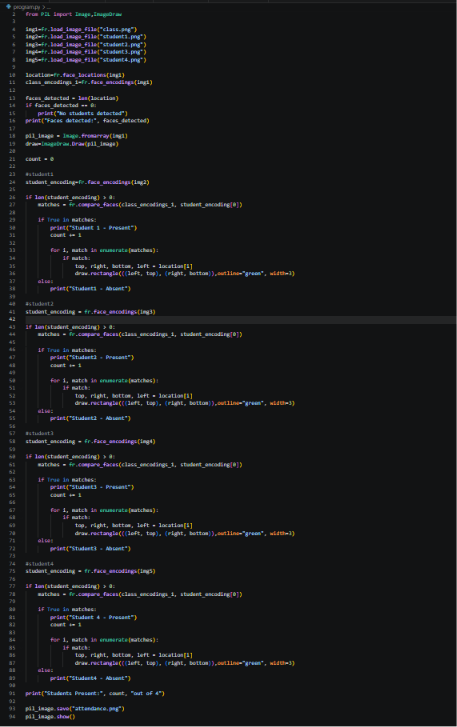
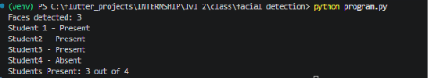
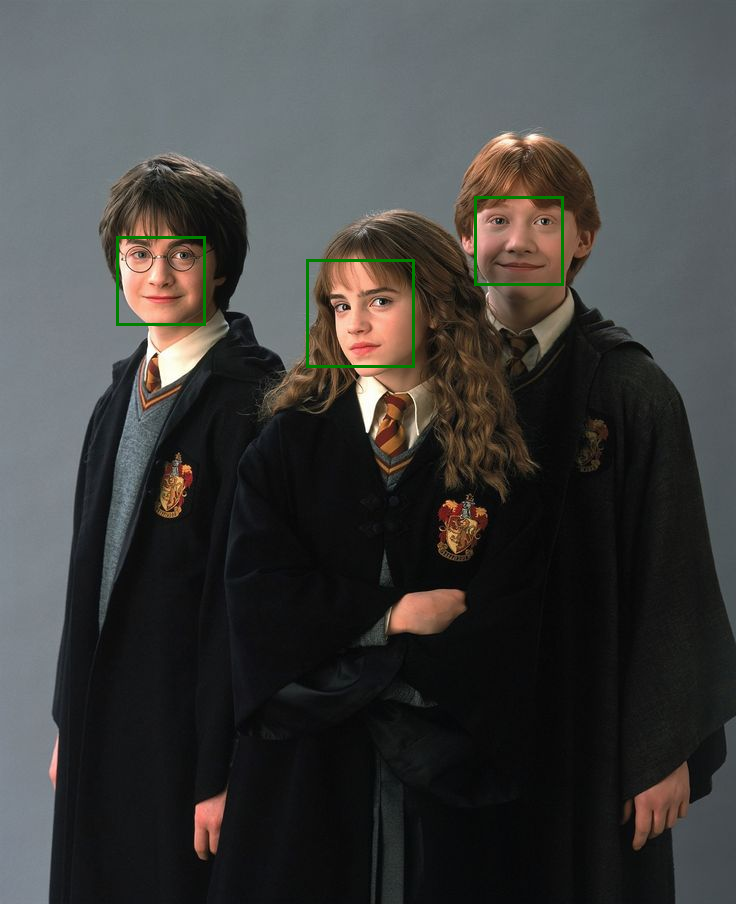

# FACIAL-DETECTION
Facial detection assignment by mithra nandhana b a

## Problem Statement
Attendance Checker

## Answer
The code is saved in the `FACIAL-DETECTION/program.py` along with the images that i used for the program.

The code and the output are given below.

## *Code*
**program code**

**output**

**attendance**

## Final Answer
*program output*
Faces detected: 3
Student 1 - Present
Student2 - Present
Student3 - Present
Student3 - Absent
